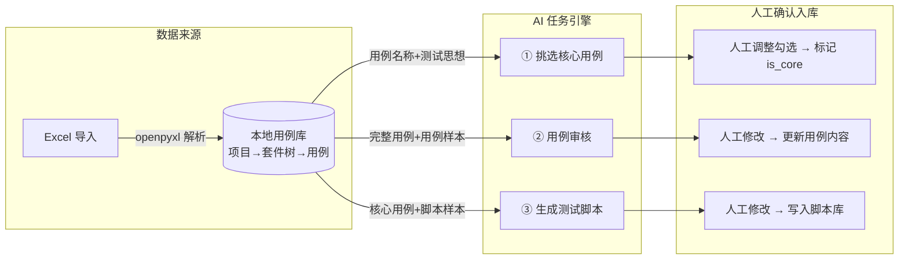

# 测试部 AI 助手 — 总体方案

## 一、总体思路



**核心设计原则：**
1. **用例落地本地库** — 从 Excel 导入到本地 PostgreSQL（多级套件树 + 用例），AI 操作、人工确认、入库全部在本地完成
2. **AI 任务化** — 三类 AI 操作统一抽象为"任务 + 任务明细"模型：异步执行、进度可查、结果留痕、人工确认后才真正入库
3. **提示词模板 + 样本库按项目隔离** — 不同产品用不同的项目，提示词和样本均按项目维护
4. **AI 服务可配置** — 不同场景可使用不同 AI 模型，通过配置表管理

---

## 二、数据库设计（9 张表）

表前缀 `ai_tc_`。所有表继承 `Base + BaseIdMixin + TimestampMixin + SoftDeleteMixin`。

| 表 | 说明 | 关键字段 |
|---|---|---|
| `ai_tc_projects` | 测试项目 | `name`, `prefix`(唯一标识), `description`, `last_sync_time` |
| `ai_tc_suites` | 测试套件（模块树） | `project_id` FK, `parent_id`, `tree_path`, `name`, `sort_order` |
| `ai_tc_cases` | 测试用例 | `suite_id` FK, `project_id`, `external_id`(Excel用例ID), `name`, `summary`(测试思想), `preconditions`, `topo`, `test_data`, `steps` JSONB, `importance`, `is_core`, `core_reason`, `core_source`, `review_status` |
| `ai_tc_prompts` | 提示词模板 | `project_id` FK(null=通用), `scene`(core_select/case_review/script_gen), `name`, `content`, `is_default`, `status` |
| `ai_tc_samples` | 样本库 | `project_id` FK(null=通用), `sample_type`(case/script), `name`, `language`, `framework`, `content`, `description`, `status` |
| `ai_tc_ai_configs` | AI 服务配置 | `name`, `provider`, `api_base`, `api_key`, `model`, `temperature`, `max_tokens`, `scenes` JSONB, `is_default`, `status` |
| `ai_tc_tasks` | AI 任务 | `task_type`, `project_id`, `suite_id`, `prompt_id`, `sample_ids` JSONB, `ai_config_id`, `model`(快照), `status`, `total_count`, `done_count`, `input_tokens`, `output_tokens`, `error_msg` |
| `ai_tc_task_items` | 任务明细 | `task_id` FK, `case_id` FK, `case_name`(快照), `output` JSONB, `item_status`, `confirm_status`, `final_content` |
| `ai_tc_scripts` | 测试脚本库 | `case_id` FK, `language`, `framework`(pytest), `content`, `source`, `task_item_id`, `version`, `status` |

### `output` JSONB 结构（按任务类型）

```json
// core_select
{ "selected": true, "reason": "覆盖登录主流程，属高风险功能" }

// case_review
{ "score": 75, "issues": ["缺少前置条件"], "suggestion": "建议补充...", "rewritten": { "preconditions": "...", "steps": [...] } }

// script_gen
{ "language": "python", "script": "def test_xxx(): ..." }
```

---

## 三、Excel 导入规范

### 模板格式（一行一条用例）

| 用例ID | 所属模块 | 用例名称 | 级别 | 测试思想 | 预置条件 | 测试Topo | 测试数据 | 测试步骤 | 预期结果 |
|---|---|---|---|---|---|---|---|---|---|
| TC-001 | 认证模块/登录 | 正确登录 | 高 | 验证登录主流程 | 已注册 | PC直连 | a/b | 1.打开页面\n2.输入登录 | 1.显示表单\n2.跳转首页 |

- **所属模块** 用 `/` 分隔多级路径
- **用例ID + 项目** 唯一，重复导入覆盖更新
- 步骤/预期结果在单元格内换行（按 `\n` 拆分，去掉行首编号）
- 重要性：高→3 / 中→2 / 低→1

---

## 四、AI 集成

### 配置表管理
- `ai_tc_ai_configs` 表管理所有 AI 服务配置
- `scenes` JSONB 记录该配置适用的场景列表
- `.env` 仅作首次种子数据兜底

### 调用方式
- `httpx.AsyncClient` 直连 OpenAI 兼容接口（DeepSeek 默认）
- 分批策略：核心用例挑选 30 条/批、用例审核 5 条/批、脚本生成 1 条/批
- JSON Mode 输出 + 正则兜底解析，失败重试 1 次

### 任务执行
- 创建任务后启动后台协程（`asyncio.create_task`）
- 前端轮询 `done_count / total_count` 显示进度
- 人工确认后才写入最终数据

---

## 五、前端页面

```
/aitc
├── /cases       index.vue    用例管理主页（树+列表+AI操作入口）
├── /review      review.vue   AI审核工作台
├── /scripts     script.vue   脚本库
├── /tasks       task.vue     AI任务记录
├── /prompts     prompt.vue   提示词模板管理
├── /samples     sample.vue   样本库管理
└── /aiconfig    aiconfig.vue AI配置管理
```

---

## 六、实施顺序

| 期 | 内容 | 状态 |
|---|---|---|
| 一期 | 9 张表 + Alembic + 项目CRUD + Excel导入 + 套件树/用例展示 + 提示词/样本/AI配置管理页 | 进行中 |
| 二期 | DeepSeek 客户端 + AI任务引擎 + 挑选核心用例 | 待开发 |
| 三期 | 用例审核工作台 | 待开发 |
| 四期 | 脚本生成 + pytest编辑 + 脚本库 + 导出 | 待开发 |
