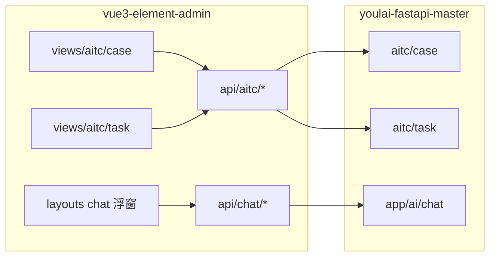

# 前端架构优化 TODO

> 创建日期：2026-08-04
> 范围：`vue3-element-admin` 前端 AITC 模块 + AI 聊天浮窗重构
> 配套文档：`后端架构优化TODO.md`（页面规划与后端拆域一一对应）
> 状态：方案已确认，待实施

## 一、背景与痛点

`src/views/aitc/` 目前 10 个页面全部平铺，无 `components/`、无 `composables/`，与项目自身约定（codegen/product 已有页面级 components 先例）严重偏离：

| 文件 | 规模 | 问题 |
|------|------|------|
| `case-review-index.vue` | 1000 行 | 树加载 + 字段三态审核 + 步骤编辑 + 进度统计全堆一起；与 `case-review.vue` 是**同一套审核逻辑的两份拷贝**（~400 行重复） |
| `layouts/components/LayoutChat.vue` | 988 行 + 1000 行 `_backup` 死文件 | 会话管理/消息流/浮窗拖拽缩放/快捷提问/PageAgent 指令全在外壳组件里 |
| `case-review.vue` | 872 行 | 审核逻辑重复实现 + 路由导航 + JSON 弹窗 |
| `index.vue`（用例主页） | 824 行 | 套件树负数 ID hack + 表格 + 标记 + 编辑表单 + Excel 导入 + aiContext 同步 |
| `layouts/components/chat/useChat.ts` | 550 行 | 手写 SSE 解析，与 `composables/sse/useSse.ts` **两套实现并存** |

其他系统性问题：

- **魔法数字遍布**：任务状态 0~4、confirm_status 1/2/3 无枚举；taskTypeLabel/statusLabel/importanceLabel 等映射函数**重复定义 5 份**
- **平台能力零复用**：已有 `usePageTable`、`CURD` 配置化组件，aitc 10 个页面全部手写 el-table + 分页兜底
- **安全问题**：`usePageAgent.ts` 硬编码 Azure OpenAI API Key 已提交进仓库；`aiconfig.vue` api_key 明文回显
- **半成品接线**：`aiContext` store 只有用例页 1 个页面接入，script/task 等页面未调用
- **路由双轨制**：列表页在后端菜单表动态注册，3 个详情页在前端静态路由，页面改名/迁移需两边同步

## 二、已确认的关键决策

1. **页面规划**（与后端拆域对齐）：用例一个页面、任务一个页面（任务详情 + 审核为任务子页面）、规范一个页面、**ai_config 页面删除**（AI 配置改后端 `.env`）。
2. **目录按页面域拆分**：`views/aitc/{case,task,sample,script,spec}/`，每域 `index.vue + components/ + composables/`，页面级组件利用已配置的 `src/**/components` 自动导入。
3. **审核逻辑收编为共享 composable**：`useCaseReview`（字段三态状态机 + 步骤编辑 + 提交）供"任务内逐条审核"和"审核工作台"两处复用，消灭 400 行拷贝。
4. **聊天浮窗拆件**：`LayoutChat.vue` 拆成外壳 + 会话侧栏 + 消息列表 + 输入区 + 拖拽 hook；删除 `LayoutChat_backup.vue`。
5. **SSE 收敛**：聊天流式仍走独立 fetch reader（SSE POST 场景），但解析/错误处理抽成公共 `parseSseStream` 工具；`composables/sse/useSse.ts`（GET 长连接）不动。
6. **魔法数字归零**：新增 `src/enums/aitc.ts` + aitc 常量文件，标签映射函数全局唯一。
7. **URL 不变**：后端接口路径 `/api/v1/aitc/...` 不动，API 层只做类型和目录整理，前端调用方批量改 import 即可。

## 三、目标结构

### 3.1 `src/views/aitc/`（5 个页面域，与后端 aitc 五包对应）

```
src/views/aitc/
├── case/                       # 用例页（← index.vue 824 行拆分）
│   ├── index.vue               # 外壳：布局 + 视图模式切换
│   ├── components/
│   │   ├── SuiteTree.vue       # 项目选择 + 套件懒加载树（负数 ID hack 就地保留并注释）
│   │   ├── CaseTable.vue       # 分页表格 + 排序筛选 + 核心/样本标记
│   │   ├── CaseDetail.vue      # 详情视图
│   │   ├── CaseEditForm.vue    # 编辑表单（步骤动态行）
│   │   └── CaseImportDialog.vue# Excel 模板下载/导入
│   └── composables/
│       └── useCasePage.ts      # 页面状态编排 + aiContext 同步
│
├── task/                       # 任务页（任务详情 + 审核为子页面）
│   ├── index.vue               # ← task.vue：任务列表 + 轮询 + 重跑
│   ├── detail.vue              # ← task-detail.vue
│   ├── case-review.vue         # ← case-review.vue（任务内逐条审核）
│   ├── script-review.vue       # ← script-review.vue
│   ├── review-index.vue        # ← case-review-index.vue（审核工作台，归属待定，见 7.4）
│   ├── components/             # TaskProgress、ReviewRecordList、FieldReviewPanel 等
│   └── composables/
│       ├── useTaskPolling.ts   # 5s 轮询（list 与 detail 共用）
│       └── useCaseReview.ts    # ★ 字段三态状态机 + 步骤编辑 + 提交（两处审核共用）
│
├── sample/                     # 样本库（← sample.vue，体量小，单文件保留）
├── script/                     # 脚本库（← script.vue）
│   ├── index.vue
│   └── components/ScriptEditDialog.vue
├── spec/                       # 规范页（← spec.vue）
│
├── constants.ts                # 任务类型/状态/场景标签映射（全局唯一来源）
└── composables/                # 跨域共享
    ├── useAitcPageTable.ts     # 在 usePageTable 上封装 aitc 分页约定
    └── useSuiteOptions.ts      # 套件树拉平 select（spec 页在用）
```

### 3.2 `src/layouts/components/chat/`（聊天浮窗拆件）

```
src/layouts/components/
├── LayoutChat.vue              # 瘦身后的外壳：组装侧栏/消息区/输入区（目标 ≤ 300 行）
└── chat/
    ├── ChatSidebar.vue         # 会话列表/分组/搜索/重命名/删除
    ├── ChatMessageList.vue     # 消息流 + 自动滚动
    ├── ChatMessage.vue         # （现有）单条消息渲染
    ├── ChatInput.vue           # 输入区 + 快捷提问 + 高度拖拽
    ├── TaskListPanel.vue       # （现有）
    ├── useChat.ts              # 精简：只管会话/消息状态 + 发送
    ├── useChatTaskPolling.ts   # 任务状态 2s 轮询器 Map（从 useChat 拆出）
    ├── useChatResize.ts        # 浮窗拖拽 + 八向缩放（~130 行 DOM 逻辑）
    ├── usePageAgent.ts         # ★ 先移除硬编码 Key，再走后端代理
    └── utils.ts                # （现有）+ parseSseStream
```

### 3.3 API 与类型

```
src/api/aitc/
├── index.ts                    # 仅聚合导出
├── types.ts                    # （现有）统一类型来源，页面内局部 interface 逐步收编
├── project.ts / suite.ts / case.ts
├── sample.ts / script.ts / spec.ts
└── task.ts                     # 含 ReviewAPI（审核收编进任务域，与后端一致）
```

- `api/chat/` 保持独立目录不动（后端 chat 也独立为 `app/ai/chat`，命名空间一致，**不并入 aitc**）。
- 删除 `AiConfigAPI`（后端端点同步删除）。

### 3.4 枚举与常量

- 新增 `src/enums/aitc.ts`：`TaskStatusEnum`、`TaskTypeEnum`、`ConfirmStatusEnum`、`ReviewActionEnum` 等。
- `views/aitc/constants.ts`：label/color 映射表，替代散落 5 处的 `xxxLabel` 函数。

## 四、与后端的对应关系



- 页面域 ↔ 后端包一一对应，排查问题时路径直觉可达。
- 审核收编：前端 `review` 相关 API 并入 `api/aitc/task.ts`，对应后端审核 API 收进 `aitc/task/router.py`。

## 五、安全问题（优先处理，独立于重构节奏）

- [ ] 1. **立即移除** `usePageAgent.ts` 硬编码的 Azure OpenAI API Key，并轮换已泄露密钥；PageAgent 改走后端代理或暂时下线
- [ ] 2. 删除 `aiconfig.vue` 页面 + `AiConfigAPI` + 后端菜单数据（随后端删端点同步进行）
- [ ] 3. 删除 `LayoutChat_backup.vue` 死文件

## 六、实施步骤

- [ ] 1. 安全三连（见「五」），可先行合入
- [ ] 2. 新增 `enums/aitc.ts` + `views/aitc/constants.ts`，全局替换 5 份标签映射和魔法数字
- [ ] 3. 抽 `useCaseReview`：合并 `case-review.vue` 与 `case-review-index.vue` 的审核逻辑（数据源差异用适配参数消化）
- [ ] 4. 拆 `case/` 域（824 行 → 外壳 + 5 组件 + 1 composable）
- [ ] 5. 建 `task/` 域：task/task-detail/case-review/script-review 迁入，抽 `useTaskPolling`
- [ ] 6. sample/script/spec 三页迁入子目录，顺带接入 `usePageTable`（或 `useAitcPageTable`）
- [ ] 7. 拆聊天浮窗：LayoutChat 外壳瘦身，抽 sidebar/input/resize/task-polling
- [ ] 8. API 层拆分 + 类型收编（删页面内重复 interface）
- [ ] 9. aiContext 接入 task/script 页面（补全注释里已写好的用法）
- [ ] 10. 路由与后端菜单同步核对（见 7.2），`vue-tsc` + 页面冒烟（用例树、审核提交、SSE 聊天、任务轮询）

## 七、注意事项

1. **页面文件路径是动态路由的依据**：`permission.ts` 用 `import.meta.glob("../views/**/*.vue")` 按后端菜单的 component 字段映射，文件移动/改名**必须同步改后端菜单表数据**，否则线上菜单白屏。建议移动前先导出菜单 SQL 清单逐条改。
2. **路由双轨制收敛**：本次维持"列表页动态 + 详情页静态"不变；详情页路径（`/aitc/tasks/:taskId/...`）不变，前端静态路由仅改 component 引用。
3. **组件自动导入**：`src/**/components` 下的组件全局自动注册，拆件后无需手写 import，但命名要避免与 `src/components` 全局组件撞名。
4. **审核工作台归属**：`review-index.vue` 业务上是"跨任务的待审核队列"，若产品确认它属于任务体系则放 `task/`，否则后续可独立为 `review/` 域——实施时先放 `task/` 减少目录。
5. **不改后端接口**：URL、请求/响应结构全部不动，本次纯前端内部重构；`as any` 和 `page?.list || records` 兜底随类型收编逐步清除。
6. **git mv 保留历史**，大文件拆分前先移动再拆，方便追溯 blame。
7. **LangGraph 二期联动**：后端会话图落地后 SSE 事件协议不变（`chunk`/`skill_start`/`message`/`error`），前端零改动；若新增 `interrupt` 续跑事件类型，届时在 `chat/types.ts` 补枚举即可。
