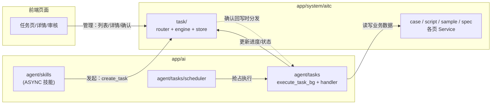

# 后端架构优化 TODO

> 创建日期：2026-08-04
> 范围：`youlai-fastapi-master` 后端 AITC 模块重构 + AI 基础设施独立
> 状态：方案已确认，待实施

## 一、背景与痛点

`app/system/aitc/` 目前 78 个文件全堆在一层，难以维护：

| 文件 | 规模 | 问题 |
|------|------|------|
| `service.py` | 76 KB / ~60 个方法 | 8 个业务域全在一个类里 |
| `router.py` | 22 KB / ~40 个端点 | 项目/套件/用例/审核/样本/配置/任务/脚本/规范混在一起 |
| `schemas.py` | 16 KB | 所有域的 DTO 一个文件 |
| `chat/` + `tasks/` + `ai_client.py` + `task_scheduler.py` | ~80 KB | AI 基础设施，与 aitc 业务耦合但定位是通用的 |

前端改造计划（同步进行）：

- 用例一个页面
- 任务一个页面，任务详情放任务目录的子目录，每个任务有详情和审核页面
- 规范一个页面
- **ai_config 页面删除**，改为后台 `.env` 配置

## 二、已确认的关键决策

1. **AI 基础设施独立为 `app/ai/`**，与 `app/system/` 平级，定位为平台级 AI 能力。
2. **models 拆**：按页面拆到各子包。FK 主干只有 `project ← suite ← case` 一条，其余表都是叶子；SQLAlchemy 的 `ForeignKey`/`relationship` 均为字符串引用，跨文件拆分无技术障碍，只需 `registry.py` 导入所有 models 模块。
3. **service 拆**：彻底拆成各页 Service，无门面，调用方各取所需（engine 用 `TaskStore` + 各页 Service，handler 通过 `TaskContext` 拿显式依赖）。
4. **AI 配置进 `.env`**：不新增 yaml。`app/config.py` 的 Settings 已有 `AI_API_BASE/AI_API_KEY/AI_MODEL` 兜底配置且 `env_nested_delimiter="__"` 已启用，扩展场景级覆盖项即可；新增 `app/ai/config.py` 提供 `resolve_ai_config(scene)`。
5. **ai_config 页面删除**：删 5 个 CRUD 端点、权限码、`AiTcAiConfig` 模型类；`task.ai_config_id` 降级为普通列；DB 表后续 alembic 迁移再删。
6. **两个 tasks 目录**：`app/ai/agent/tasks/`（skill 发起的任务执行体系）与 `app/system/aitc/task/`（前端任务页 API + 业务），职责分离。
7. **审核收编**：用例审核 API 随任务模型进 `aitc/task/`，对应前端"审核变成任务子页面"。
8. **URL 全部不变**（`/api/v1/aitc/...`），前端零改动；文件移动用 `git mv` 保留历史。

## 三、目标结构

### 3.1 `app/ai/`（AI 能力平台，三大类：chat / client / agent）

```
app/ai/
├── __init__.py
├── client.py                  # ← aitc/ai_client.py：AiClient
├── config.py                  # 新增：resolve_ai_config(scene)，从 .env 读取
│
├── chat/                      # 对话：会话管理 + 对话编排（← aitc/chat/ 整体平移）
│   ├── models.py / schemas.py / service.py / router.py   # 4 张表：会话/消息/草稿/用量日志
│   ├── orchestrator.py        # 对话编排器：收消息→意图路由→技能执行/自由对话(SSE流式)
│   ├── intent_router.py       # 关键词意图路由
│   ├── session_manager.py     # 会话上下文（当前项目/套件/页面）
│   ├── context_builder.py     # 上下文构建注册表（构建器实现移到 skills/case/contexts.py）
│   ├── usage_logger.py        # token 计量
│   └── graph.py               # 【二期】会话图：LangGraph 重写 orchestrator 内部实现，见「八」
│
└── agent/                     # 智能体：技能 + 任务执行
    ├── __init__.py
    ├── skills/                # 对话技能（← chat/domains + skill_base + tool_bus）
    │   ├── __init__.py        # 导入各领域完成注册
    │   ├── base.py            # ← chat/skill_base.py：BaseSkill + SkillRegistry
    │   ├── bus.py             # ← chat/tool_bus.py：工具总线（仅技能使用）
    │   └── case/              # 用例域 6 技能 + tools + contexts
    │       ├── core_select.py     # 挑核心（ASYNC）
    │       ├── case_review.py     # 审核（ASYNC）
    │       ├── script_gen.py      # 生成脚本（ASYNC）
    │       ├── field_complete.py  # 字段补全（SYNC）
    │       ├── step_complete.py   # 步骤补写（SYNC）
    │       └── case_design.py     # 用例设计（SYNC）
    ├── graphs/                # 【二期】LangGraph 作业流程编排，见「八」
    │   ├── base.py            # 公共 State 基类、checkpointer、node 工具
    │   ├── core_select.py     # 挑核心：粗筛 → 分批精评 → 汇总排序
    │   ├── case_review.py     # 审核：逐条评审 → 交叉复核 → 汇总
    │   └── script_gen.py      # 脚本生成流程
    └── tasks/                 # 任务执行体系（skill 发起 → 调度器执行）
        ├── __init__.py        # handler 注册表 + execute_task_bg
        ├── base.py            # BaseTask + TaskContext（持有各领域 Service）
        ├── scheduler.py       # ← aitc/task_scheduler.py：轮询任务表，抢占 QUEUED
        ├── prompts/           # ← aitc/prompts/：任务提示词模板
        ├── case/              # 执行 handler：core_select / case_review / script_gen
        └── bug/
```

### 3.2 `app/system/aitc/`（纯业务数据域，5 个页面各一套：models/service/router/schemas）

```
app/system/aitc/
├── __init__.py                # 聚合 5 个页面 router（⚠ 路由注册顺序注意见下）
├── constants.py               # 共享枚举 + 权限码（删 aiconfig 权限码）
│
├── case/                      # 用例页
│   ├── models.py              # Project / Suite / Case 3 张表
│   ├── schemas.py
│   ├── service.py             # CaseService：项目/套件树/用例 CRUD/Excel 导入
│   └── router.py
│
├── sample/                    # 样本库页（被任务和技能引用，保留）
│   ├── models.py              # Sample 1 张表
│   ├── schemas.py / service.py / router.py
│
├── script/                    # 脚本库页
│   ├── models.py              # Script 1 张表
│   ├── schemas.py / service.py / router.py
│
├── spec/                      # 规范页
│   ├── models.py              # Spec 1 张表
│   ├── schemas.py / service.py / router.py
│
└── task/                      # 任务页（前端 task 页/详情/审核的 API + 业务）
    ├── models.py              # Task / TaskItem / ReviewRecord 3 张表
    ├── schemas.py
    ├── store.py               # TaskStore：任务表数据存取（状态/进度/token/审核记录）
    ├── engine.py              # ← aitc/task_engine.py：业务编排（创建/重跑/查询/确认）
    └── router.py              # 任务页/详情/审核 API + 用例审核 API（pending-tree/review-detail/review_case）
```

## 四、核心概念与关系

### 4.1 Skill 和 Task 的关系

| | Skill（技能） | Task（任务） |
|---|---|---|
| 本质 | 对话里的一个**意图处理器** | 批量**异步作业** |
| 触发 | 用户发消息，意图路由命中 | 调度器轮询抢占 |
| 生命周期 | 一次问答 | QUEUED→RUNNING→COMPLETED→CONFIRMED |
| 产出 | 草稿卡片 / 任务卡片 | task_items 结果，人工确认回写 |

- SYNC 技能（字段补全/步骤补写/用例设计）：对话内即时完成，与 Task 无关。
- ASYNC 技能（挑核心/审核/生成脚本）：参数收齐后调用 `aitc/task/engine.create_task` 委托执行，与任务类型一一对应，是 Task 在对话里的入口。

### 4.2 三方调用关系



- **skill → aitc/task**：ASYNC 技能调用 `engine.create_task` 发起任务（ai → aitc，顺向）。
- **scheduler → agent/tasks**：抢占后跑 `execute_task_bg` → handler 执行，经 aitc 各页 Service 读写用例/脚本，经 task/store 更新进度（ai → aitc，顺向）。
- **前端 → aitc/task**：任务页所有管理操作都在这。
- **唯一一处反向**：`engine` 确认回写时按任务类型分发到 handler 的 `apply_result`（aitc → ai.agent.tasks 注册表）。不构成循环 import——handler 只依赖 `case`/`script` 服务和 `task/models`（叶子模块），不依赖 `task/engine`。

### 4.3 依赖总方向（单向，无环）

```
main.py ──► app/ai/chat ──► app/ai/agent ──► app/system/aitc
                                              （aitc 不 import 任何 app/ai 内容）
```

## 五、AI 配置方案（.env）

```bash
# .env
AI_API_BASE=https://api.deepseek.com
AI_API_KEY=sk-xxx
AI_MODEL=deepseek-chat
AI_CHAT__MODEL=deepseek-chat          # 场景覆盖（可选，不配回落默认）
AI_CORE_SELECT__MODEL=deepseek-reasoner
```

- `app/config.py` Settings 扩展场景级字段（利用已有 `env_nested_delimiter="__"`）。
- 新增 `app/ai/config.py`：`resolve_ai_config(scene)` 从 settings 读，scene 无覆盖时回落 `AI_API_BASE/AI_API_KEY/AI_MODEL`。
- 删除：aiconfig 5 个 CRUD 端点、权限码、`AiTcAiConfig` 模型类；`ai_tc_tasks.ai_config_id` 保留为普通列（不再 FK）。

## 六、实施步骤

- [ ] 1. `git mv` 平移：`chat/`、`tasks/`、`prompts/` → `app/ai/`；`ai_client.py`→`app/ai/client.py`
- [ ] 2. `chat/skill_base.py`→`agent/skills/base.py`、`chat/tool_bus.py`→`agent/skills/bus.py`、`chat/domains/`→`agent/skills/`，批量改 import
- [ ] 3. `task_scheduler.py`→`agent/tasks/scheduler.py`；`tasks/` 下 handler 平移到 `agent/tasks/case|bug`
- [ ] 4. `task_engine.py`→`aitc/task/engine.py`；新建 `aitc/task/`（models/store/router/schemas 从 service/router/models/schemas 中拆出）
- [ ] 5. aitc 拆 `case/sample/script/spec` 四包（models/service/router/schemas 各一套）
- [ ] 6. 新建 `app/ai/config.py`，Settings 加场景级配置，改造 `resolve_ai_config`，删 aiconfig 端点/权限码/模型类
- [ ] 7. 各页 Service 彻底拆分，调用方改引用（engine/handler/chat 经 TaskContext 显式注入）
- [ ] 8. 更新 `main.py`（注册 aitc 聚合 router + ai.chat router）、`registry.py`（导入所有 models 模块）
- [ ] 9. lint + 启动冒烟验证（路由注册顺序、SSE、调度器、任务全链路）
- [ ] 10.【二期】新建 `agent/graphs/`：base + core_select/case_review/script_gen 三张作业图，handler 改为薄适配层（见「八」）
- [ ] 11.【二期】新建 `chat/graph.py`：LangGraph 重写 orchestrator 内部实现，保留关键词 fast path（见「八」）

## 七、注意事项

1. **路由注册顺序**：`aitc/__init__.py` 聚合时，固定路径（如 `/cases/pending-tree`）必须先于参数路径（`/cases/{case_id}`）注册。
2. **URL 不变**：所有端点保持 `/api/v1/aitc/...`，前端零改动。
3. **数据库零迁移**：表名全部不变；`ai_tc_ai_configs` 表代码层先删模型，DB 表留待后续 alembic 迁移。
4. **文件移动用 `git mv`** 保留历史。
5. `chat/context_builder.py` 注册表留在 chat，用例域构建器实现移到 `agent/skills/case/contexts.py`。

## 八、LangGraph 编排方案（二期，2026-08-04 补充）

两层图各司其职，互不交叉：

| | 会话图 `chat/graph.py` | 作业图 `agent/graphs/` |
|---|---|---|
| 编排对象 | 一次对话消息：意图识别 → skill 调用 → 响应 | 一次作业内部：多节点 LLM 流程（粗筛→精评→汇总…） |
| 生命周期 | 一个 HTTP 请求，流式返回即结束 | 任务的后台执行过程，可能跑几分钟 |
| 状态 | 会话上下文；多轮收参用 interrupt + checkpointer | 图内 State 在节点间传递，单次执行内有效 |
| 触发方 | 用户发消息 | scheduler 抢占任务后由 handler 调用 |

### 8.1 作业图 `agent/graphs/`

- handler 变薄：只负责「准备上下文 → `graph.ainvoke()` → 结果落 task_items」，不再内嵌提示词拼接和散装多轮调 LLM。
- 复用性：SYNC 技能（如用例设计）若升级为多步流程，可直接调同一 graph，不必经过任务体系。
- 依赖方向不变：`graphs/` 只依赖 `app/ai/client.py`、`app/ai/config.py` 和经 `TaskContext` 注入的 aitc Service，不 import `skills/`、`tasks/`；不放 `aitc/` 里（图编排是 AI 能力，会污染业务域）。
- 断点续跑以任务表为准（task_items 已落库的不重做），graph 内部状态只做单次执行内传递，两者职责不混。

### 8.2 会话图 `chat/graph.py`（重写 orchestrator 内部实现）

- 节点：load_context → agent（LLM + bind_tools）→ ToolNode（执行 skill.execute）/ 自由对话流式输出 → respond。
- **Skill 抽象完全保留**：6 个 skill 业务代码零改动，`skill_base.py` 的 `to_openai_tool()` / `get_tools_for_domain()` 现成接上，只是从「关键词命中」变成「LLM tool 调用」。
- **混合路由**：现有 `intent_router` 降级为 fast path，关键词高置信命中直接进 tool 节点；不命中才走 LLM 路由（控制延迟与 token 成本）。
- **SSE 流式**：用 `graph.astream_events()` 把 LLM token 映射为现有 `chunk` 事件、tool 开始/结束映射为 `skill_start`/`message`，前端事件协议不变。
- **多轮参数收集**：缺参时用 `interrupt` 挂起 → 返回 clarify_card → 用户下条消息续图执行（替代现在 extract_params 一把梭）；checkpointer 短期内存，长期挂现有 DB。
- ASYNC 技能路径不变：tool 节点执行结果即 `create_task` + 任务卡片，后台仍走 scheduler → handler → 作业图。**会话图的 tool 节点恰好是作业图的入口**。

### 8.3 代价与缓解

| 代价 | 缓解 |
|---|---|
| 每条消息多一次 LLM 意图调用，延迟 +1~2s、token 成本上升 | 混合路由：关键词 fast path 跳过 agent 节点 |
| LLM 路由不如关键词可预测，可能误触发/漏触发 | tool 描述写清触发边界；`required_page` 准入保留为 tool 执行前 guard；加路由日志 |
| 调试链路变长 | LangSmith 或自建 trace；一期图画简单（单 agent 节点 + ToolNode） |

### 8.4 依赖

- `pyproject.toml` 加 `langgraph` + `langchain-core`（只用 Runnable/消息协议，不引全套 langchain）。
- 公共件（State 基类、checkpointer 配置、LLM 节点工厂）放 `agent/graphs/base.py`，会话图与作业图共享。
- 提示词若体量大，可从 `agent/tasks/prompts/` 上移到 `agent/graphs/prompts/`，或按节点就近放。
